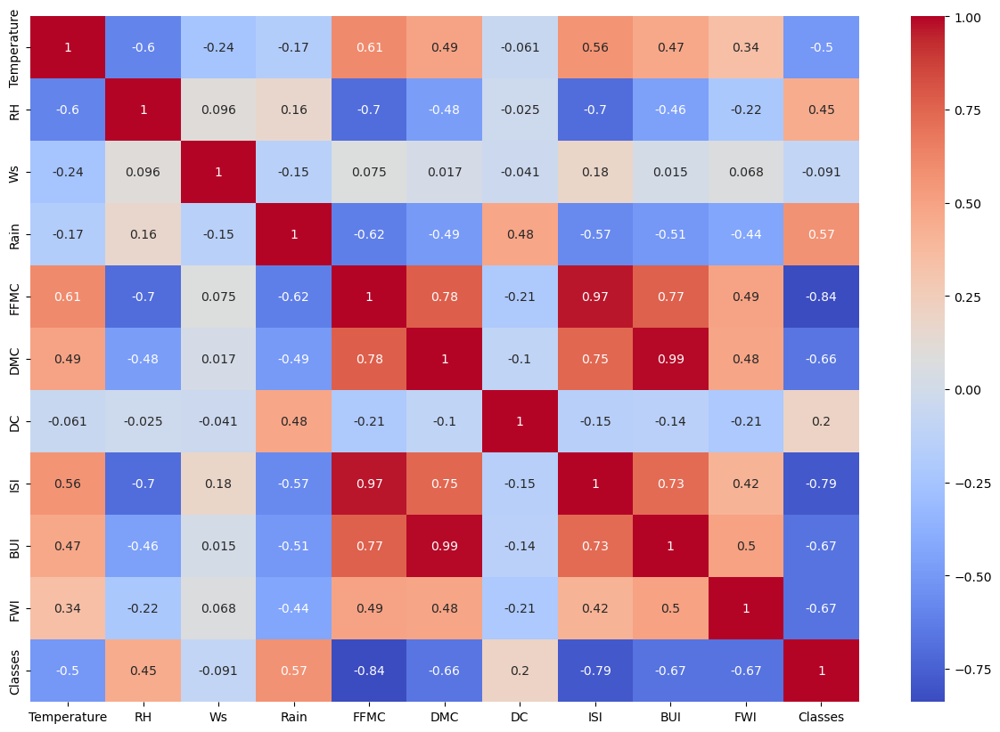

# Notes

## scatter plots

### all data sp

- When `BUI` is less than 20, there is no fire observed.
  
- Fire is not observed when `DMC` is below 15.
  
- Fire is not observed when the value of `FFMC` is less than 80.
  
- If `FWI` is less than 10, no fire is detected.
  
- No fire is observed when `ISI` is below 20.
  
- The `FWI` value is considered excessive when `ISI` ranges from 20 to 70 and `FFMC` ranges from 75 to 150.
  

### bejaia sp

- When `DC` is less than 25, there is no fire observed.
  

## time series

### bejaia ts

In the region of Bejaia, the following behaviors were observed:

- We have noticed that it is possible to draw a line that can divide the plot into two distinct parts.
  

- Behavior 1 includes Temperature, FFMC, DMC, DC, ISI, BUI, and FWI. Please refer to the image "bejaia behavior 1" for more details.
  <!-- behavior_1 = [Temperature, FFMC, DMC, DC, ISI, BUI, FWI] -->
  
- Behavior 2 consists of RH, Rain, and Classes. For further information, please see the image "bejaia behavior 2."
  <!-- behavior_2 = [RH, Rain, Classes] -->
  
- Behavior 3 is characterized by Ws. Please refer to the image "bejaia behavior 3" for more details.
  <!-- behavior_3 = [Ws] -->
  

### sidi bel abbes ts

In the region of Sidi Bel Abbes, the following behaviors were observed:

- We have noticed that it is possible to draw a line that can divide the plot into two distinct parts.
  

- Behavior 1 includes Temperature, FFMC, DMC, ISI, BUI, and FWI. Please refer to the image "sidi bel abbes behavior 1" for more details.
  <!-- behavior_1 = [Temperature, FFMC, DMC, ISI, BUI, FWI] -->
  
- Behavior 2 consists of RH, Rain, and Classes. For further information, please see the image "sidi bel abbes behavior 2."
- Behavior 3 is characterized by Ws. Please refer to the image "sidi bel abbes behavior 3" for more details.
  <!-- behavior_2 = [RH, Rain, Classes] -->
  
  <!-- behavior_3 = [Ws] -->
  
- Behavior 4 includes DC. Please refer to the image "sidi bel abbes behavior 4" for more details.
  <!-- behavior_4 = [DC] -->
  

## heat maps

### all data hm

- Temperature has a strong positive correlation with FFMC (Fine Fuel Moisture Code), DMC (Duff Moisture Code), and DC (Drought Code), indicating that as temperature increases, these variables also tend to increase.
- Temperature has a moderate negative correlation with RH (Relative Humidity), suggesting that as temperature increases, relative humidity tends to decrease.
- RH has a strong negative correlation with FFMC, DMC, DC, and ISI (Initial Spread Index), indicating that as relative humidity increases, these variables tend to decrease.
- Rain has a moderate positive correlation with DC, ISI, BUI (Build Up Index), and Classes, suggesting that as rainfall increases, these variables tend to increase.
- FFMC has a strong negative correlation with Classes, indicating that as FFMC decreases, the fire danger classes tend to increase.
- DMC and BUI have a strong positive correlation, suggesting that as DMC increases, so does BUI.
- FFMC and DMC have a strong positive correlation with ISI and FWI (Fire Weather Index), indicating that as FFMC and DMC increase, ISI and FWI also tend to increase.
- Classes have a strong negative correlation with FFMC, DMC, DC, ISI, BUI, and FWI, suggesting that as these fire danger variables increase, the fire classes tend to decrease.

### bejaia hm

Here are the insights that can be derived from the correlation matrix you provided:

- Temperature has a strong positive correlation with FFMC (Fine Fuel Moisture Code), DMC (Duff Moisture Code), DC (Drought Code), and ISI (Initial Spread Index). This suggests that as temperature increases, these variables tend to increase as well.
- Temperature has a moderate negative correlation with RH (Relative Humidity) and Classes. This implies that as temperature increases, relative humidity tends to decrease, and fire danger classes tend to decrease.
- RH has a strong negative correlation with FFMC, DMC, DC, ISI, and BUI (Build Up Index). This indicates that as relative humidity increases, these fire danger variables tend to decrease.
- Rain has a moderate positive correlation with DC, ISI, BUI, and Classes. This suggests that as rainfall increases, these variables tend to increase.
- FFMC has a strong negative correlation with RH, Rain, and Classes. This implies that as FFMC decreases, relative humidity, rainfall, and fire danger classes tend to increase.
- DMC has a strong positive correlation with FFMC, DC, ISI, BUI, and FWI (Fire Weather Index). This indicates that as DMC increases, these fire danger variables tend to increase as well.
- DC has a strong positive correlation with FFMC, DMC, ISI, BUI, and FWI. This suggests that as DC increases, these fire danger variables tend to increase.
- ISI has a strong positive correlation with FFMC, DMC, DC, BUI, and FWI. This implies that as ISI increases, these fire danger variables tend to increase.
- BUI has a strong positive correlation with DMC, DC, ISI, and FWI. This indicates that as BUI increases, these fire danger variables tend to increase.
- FWI has a strong positive correlation with FFMC, DMC, DC, ISI, and BUI. This suggests that as FWI increases, these fire danger variables tend to increase.
- Classes have a strong negative correlation with FFMC, DMC, DC, ISI, BUI, and FWI. This implies that as these fire danger variables increase, the fire classes tend to decrease.

### sidi bel abbes hm

- Temperature has a strong positive correlation with FFMC (Fine Fuel Moisture Code), ISI (Initial Spread Index), and BUI (Build Up Index). This suggests that as temperature increases, these variables tend to increase as well.
- Temperature has a moderate negative correlation with RH (Relative Humidity) and Classes. This implies that as temperature increases, relative humidity tends to decrease, and fire danger classes tend to decrease.
- RH has a strong negative correlation with FFMC, ISI, and Classes. This indicates that as relative humidity increases, these fire danger variables tend to decrease.
- Rain has a moderate positive correlation with DC (Drought Code) and Classes. This suggests that as rainfall increases, these variables tend to increase.
- FFMC has a strong negative correlation with RH, Rain, DC, and Classes. This implies that as FFMC decreases, relative humidity, rainfall, drought code, and fire danger classes tend to increase.
- DMC (Duff Moisture Code) has a strong positive correlation with FFMC, ISI, BUI, and FWI (Fire Weather Index). This indicates that as DMC increases, these fire danger variables tend to increase as well.
- DC has a moderate positive correlation with Rain and a weak negative correlation with FFMC and Classes. This suggests that as rainfall and FFMC decrease, drought code tends to increase, and fire danger classes tend to decrease.
- ISI has a strong positive correlation with FFMC, BUI, and FWI. This implies that as ISI increases, these fire danger variables tend to increase.
- BUI has a strong positive correlation with DMC, ISI, and FWI. This indicates that as BUI increases, these fire danger variables tend to increase.
- FWI has a strong positive correlation with FFMC, ISI, and BUI. This suggests that as FWI increases, these fire danger variables tend to increase as well.
- Classes have a strong negative correlation with FFMC, RH, DC, and FWI. This implies that as these fire danger variables increase, the fire classes tend to decrease.

## Ethical Considerations

- As with any correlation analysis, it's important to note that correlation does not imply causation, and further analysis and domain knowledge are necessary to draw definitive conclusions based on these correlations.
